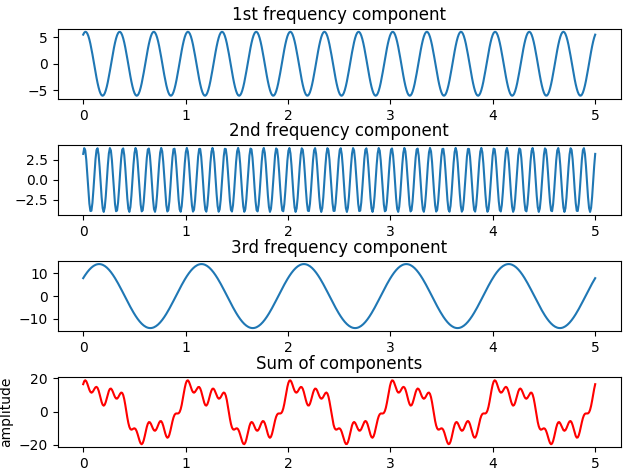

# Fast-Fourier-Transform-FFT-algorithm-
 

## FFT algorithm implimentation

An FFT, or Fast Fourier Transform, is an efficient implementation of a Discrete Fourier Transform. The algorithm transforms a sum of sinusoidal signals into into its pure frequency components. In the following quiz, we will demonstrate adding sinusoidal waves together and then deconstructing them back into their component frequencies.
   

 

## Instructions:

### Choose_frequencies:
 
In the first definition, choose_frequencies, choose three frequencies in a range from 1 to 50. These are the number of full cycles each sinusoidal wave will have in one "time unit". Running the definition will produce a visual of the three chosen frequencies as well as a new wave that is the sum of the three. This is similar to an acoustic signal, which is the sum of many sinusoidal waves. The waves may have different phases and amplitudes as well. Here's an example of a choice of (3, 8, 1) for the three frequencies.

 
